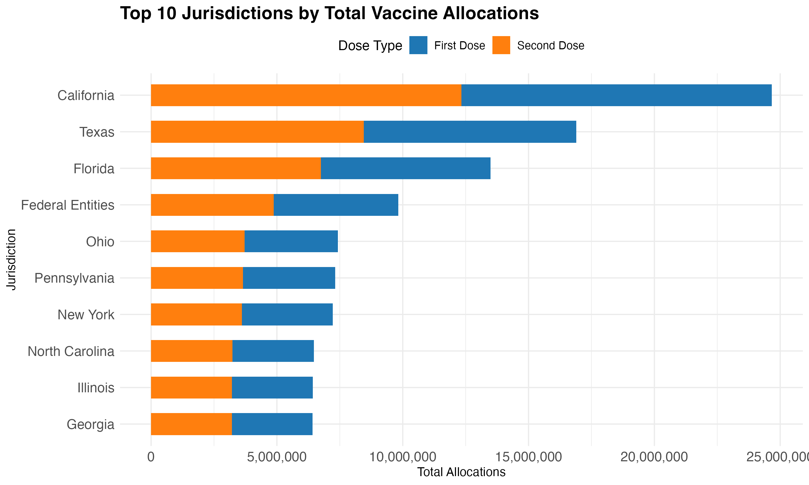

# Introduction

The dataset used in this analysis pertains to the distribution of Pfizer COVID-19 vaccine allocations across various jurisdictions. The primary objective of this analysis is to explore the vaccine allocation by jurisdiction and assess the relationship between population size and vaccine allocation. We will load the dataset, summarize key variables, and create both a table and a figure to visualize the data.

```{r, load-data, echo=FALSE, message=FALSE, warning=FALSE}
file_path <- file.path("/Users/zolismith/Desktop/COVID19_Vaccine_Distribution_Analysis/data/DATASET.csv")

data <- read.csv(file_path)
```

### Summary Table

A summary table of key variables, such as Pfizer vaccine allocation and jurisdiction population.

### Summary Table

```{r summary-table, echo=FALSE, message=FALSE, warning=FALSE}
source("/Users/zolismith/Desktop/COVID19_Vaccine_Distribution_Analysis/scripts/create_required_table.R")
htmltools::includeHTML("tables/required_table.html")
```

### Table Description

Table 1 summarizes the vaccine allocation by jurisdiction, showing both the first and second dose allocations. This table offers a quick overview of the distribution of vaccines across jurisdictions.

## Figure: Vaccine Allocation by Jurisdiction

This stacked bar chart displays the total vaccine allocations across the top 10 jurisdictions, with the first dose shown in blue and the second dose in orange. The jurisdictions are ordered by total allocations, and the y-axis represents the total number of doses allocated. The chart provides a clear comparison of both the first and second dose distributions across the jurisdictions.

```{r, figure-data, echo=FALSE, message=FALSE, warning=FALSE}
source("/Users/zolismith/Desktop/COVID19_Vaccine_Distribution_Analysis/scripts/create_required_figure.R")

```
